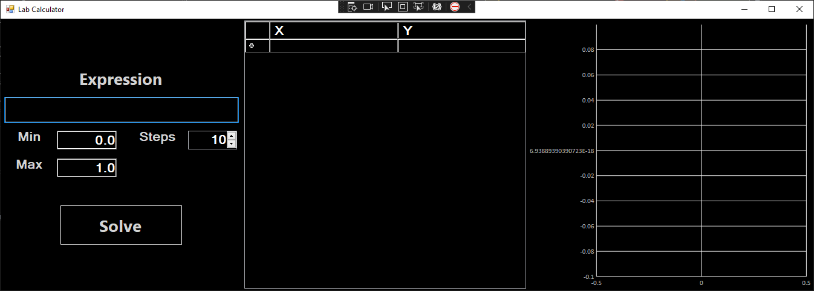
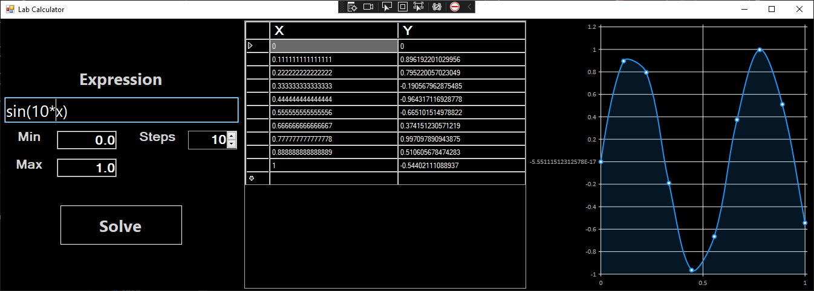
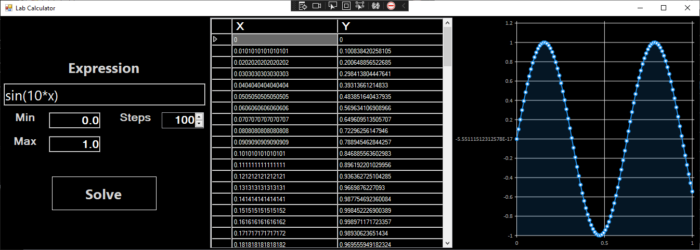
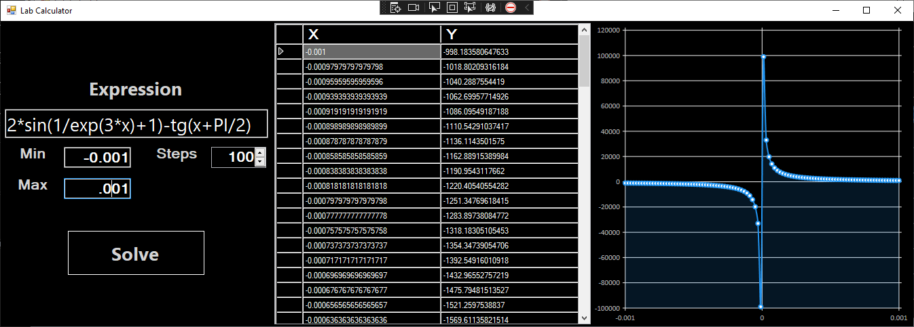

# CTnCT-Lab1
Computational Theory and Computer Technology Lab 1

## The program parses the expression, put the result in a table and displays it on the graph

### Application Screens:

#### Start Sreen

#### Example with Sin function

#### Example with Sin function with more points

#### Example with some function

